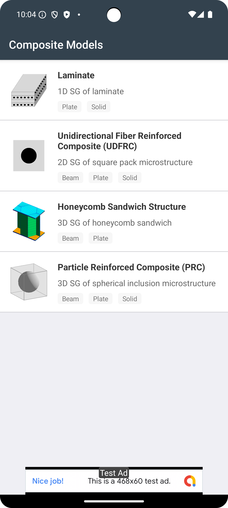
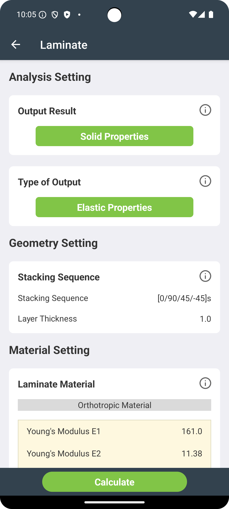

# SwiftComp_Andriod_App

SwiftComp_Andoird_App  is a mobile application designed to provide a comprehensive composite calculator based on the SwiftComp software, an efficient multiscale modeling tool for composites. 

This is the old version of SwiftComp Android App created by Kotlin. For the most recent version is using Flutter!. Check it out: https://github.com/banghuazhao/swiftcomp-flutter

## Installation

### Android
Download SwiftComp-flutter from the [Google Play Store](https://play.google.com/store/apps/details?id=com.banghuazhao.swiftcomp&hl=en_US).

## Screenshots

## Usage

1. **Select a Material:** Choose from the existing material database or add a new material.
2. **Input Parameters:** Enter the necessary parameters for your composite material.
3. **Calculate:** Press the calculate button to obtain results.
4. **View Results:** The app provides detailed information on the composite's properties.
